# 🧠 FPGA Convolution Engine — VHDL Implementation for CNN Acceleration

A fully generic and reconfigurable 2D convolution accelerator implemented in VHDL for FPGA-based image processing and convolutional neural network (CNN) inference. This project was developed as part of the thesis **“Procesamiento eficiente de redes neuronales de convolución a través de aceleradores hardware”** and focuses on reducing convolution processing time through configurable hardware parallelism, reusable resources, and multi-layer support.

***

## 📖 Table of Contents

- [Overview](#overview)
- [Architecture](#architecture)
- [Module Descriptions](#module-descriptions)
  - [top\_convolution](#top_convolution-top-level)
  - [Controller](#controller-fsm)
  - [LineBuffer](#linebuffer)
  - [WindowRegister](#windowregister)
  - [FilterMemory](#filtermemory)
  - [ConvolutionBlock](#convolutionblock)
  - [ActivationFunction](#activationfunction)
  - [OutputBuffer](#outputbuffer)
- [Generic Parameters](#generic-parameters)
- [Port Interfaces](#port-interfaces)
- [Supported Filter Types](#supported-filter-types)
- [Simulation & Testbench](#simulation--testbench)
- [File Structure](#file-structure)
- [How to Run](#how-to-run)
- [Design Notes](#design-notes)

***

## Overview

This project implements a **hardware accelerator for 2D convolution** in VHDL, intended for FPGA-based processing of digital images and for the convolution stages of CNNs. In the thesis, the convolution stage is identified as the computationally dominant part of a CNN, often representing most of the arithmetic cost of the network, which motivates a hardware-oriented optimization strategy.

The proposed solution is based on a **streaming architecture**, meaning that the system processes the image pixel by pixel and updates the convolution window in real time. Instead of rebuilding hardware for each layer, the architecture exposes runtime configuration ports for kernel size, number of filters, stride, padding, and activation, allowing the same hardware structure to be reused across different convolution layers.

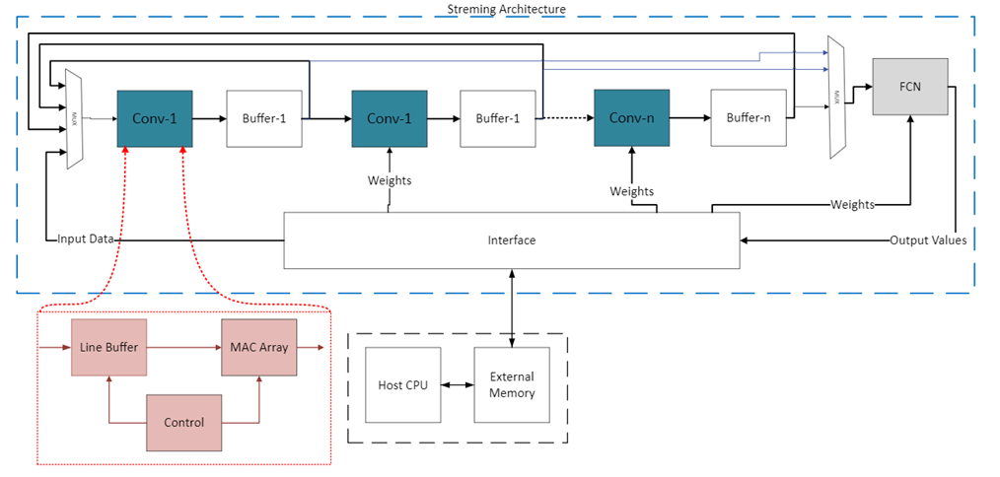
**Figure:** General hardware accelerator scope within the CNN processing pipeline.

The central idea of the thesis is that the performance of convolution can be improved by controlling the **degree of parallelism** at two levels:
- parallelism in the number of filters processed,
- parallelism in the number of multiply-accumulate operations executed inside each convolution.

Because of this, the architecture was designed not only to compute convolution correctly, but also to serve as a platform for analyzing the relationship between:
- hardware resource usage,
- processing time,
- kernel size,
- number of filters,
- and multi-layer reuse.

***

## Architecture

The design follows a structural top-level organization in `top_convolution`, where the full convolution pipeline is divided into modular blocks with clearly separated functions.

```text
pixel_in ──► [LineBuffer × (K_MAX-1)] ──► build_column
                                              │
                                              ▼
                                       [WindowRegister]
                                              │
                           ┌──────────────────┘
                           │      K×K window pixels
                           ▼
         [FilterMemory] ──► [ConvolutionBlock] ──► [ActivationFunction] ──► pixel_out
                                    ▲
                                    │
                             [Controller FSM]
                 (lb_we, wr_update, conv_start, ob_we, finished)
```
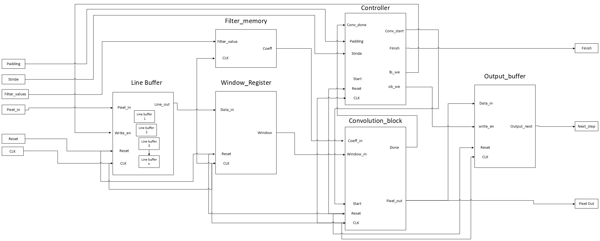
**Figure:** Full RTL-level architecture of the proposed convolution accelerator.

From the thesis perspective, this architecture is divided into five functional stages:

1. **Input data preparation**, where image values are preprocessed, normalized, converted to binary/fixed-point, and provided to the testbench through text files.
2. **Input data stage**, where LineBuffers and the WindowRegister reconstruct the convolution mask from a streaming pixel flow.
3. **Convolution stage**, where the current K×K window is multiplied by one or more filters and then reduced through an adder structure.
4. **Synchronization stage**, where the Controller FSM coordinates writes, shifts, convolution start, and output timing while handling stride and padding behavior.
5. **Optional output accumulation / post-processing**, where activation and output buffering prepare the result for later stages.

This decomposition matches the thesis methodology: first guarantee correct streaming access to image pixels, then implement the convolution core, and finally synchronize the full dataflow so the architecture behaves as a single hardware accelerator.

### Processing Flow

At runtime, the architecture works as follows:

1. Pixels are received one per clock cycle.
2. `K_MAX-1` LineBuffers store previous image rows.
3. A vertical column of pixels is built from delayed rows plus the current input pixel.
4. The WindowRegister shifts and updates the active K×K convolution window.
5. Filter coefficients are read from FilterMemory.
6. ConvolutionBlock performs parallel multiply and accumulation operations.
7. ActivationFunction optionally applies ReLU.
8. The output is delivered as packed filter results, while the Controller determines when the output is valid and when the full frame is finished.

### Controller States

The Controller implements a finite state machine with seven states that synchronize all blocks:

| State | Description |
|---|---|
| `IDLE` | Waits for `start = '1'` |
| `LOAD_INITIAL` | Loads the first `(K-1)` image lines needed before valid convolution can begin |
| `LOAD_PIX` | Continues receiving pixels from the current row |
| `SHIFT_WINDOW` | Updates the WindowRegister with the new pixel column |
| `COMPUTE_CONV` | Starts the convolution and waits for `conv_done` |
| `WRITE_OUT` | Advances counters and marks output timing |
| `DONE` | Signals end of image processing and returns to `IDLE` |

This FSM is especially important in the thesis because it is the block where stride and padding behavior are integrated into the general hardware flow.

***

## Module Descriptions

### `top_convolution` (Top Level)

**File:** `top_convolution-9.vhd`

This is the main structural wrapper of the design. It instantiates all functional modules, connects the control signals, and exposes the generic/run-time interface used by the testbench or by future external control logic.

The top-level entity was designed to support **reconfigurable hardware operation**, which is one of the key thesis contributions. Instead of defining a fixed-size accelerator for only one CNN layer, the design uses maximum generic limits (`K_MAX`, `F_MAX`) and runtime parameters (`effective_K`, `effective_F`) so the same synthesized architecture can operate with different active configurations.

This strategy allows:
- **resource reuse** across different layers,
- easier experimentation with different convolution setups,
- and support for a **multi-layer flow without recompiling** the design.

Internally, the top-level includes a generic `generate` structure to create the required number of LineBuffers, plus a combinational block that assembles the `column_to_window` signal used by the WindowRegister.

**Relevant internal signals:**

| Signal | Width | Description |
|---|---|---|
| `line_outs` | `K_MAX × (WIDTH×BITS)` | Packed delayed rows from LineBuffers |
| `column_to_window` | `K_MAX × BITS` | Current vertical pixel column |
| `wr_window` | `K_MAX² × BITS` | Flattened active convolution window |
| `fm_coeffs` | `F_MAX × K_MAX² × COEFFW` | Packed filter coefficients |
| `conv_pixel` | `F_MAX × OUTW` | Raw convolution outputs |
| `activated_pixel` | `F_MAX × OUTW` | Post-activation outputs |
| `global_done` | 1 | Final completion signal |

***

### `Controller` (FSM)

**File:** `Controller-4.vhd`

The Controller is the synchronization core of the architecture. In thesis terms, it belongs to the **bloque de sincronización**, and its purpose is to coordinate the entire streaming convolution process so that every hardware block receives its enable signals at the correct clock cycle.

This block manages:
- image traversal,
- initial line loading,
- window updates,
- convolution triggering,
- output progression,
- and frame completion.

It also integrates two important CNN parameters directly into hardware behavior:

- **Stride**, by controlling how many pixel positions the processing window advances after each convolution.
- **Padding**, by initializing counters with negative offsets and extending the effective processing region.

This is significant because it lets the architecture emulate common CNN boundary behaviors without changing the main datapath modules. In the thesis, stride and padding are treated as part of the control layer rather than part of the arithmetic layer.

**Generics:** `WIDTH`, `HEIGHT`, `K_MAX`

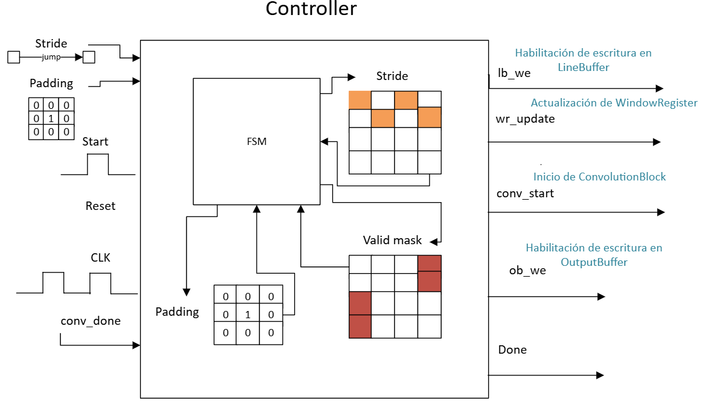
**Figure:** Controller block used to synchronize the convolution pipeline.

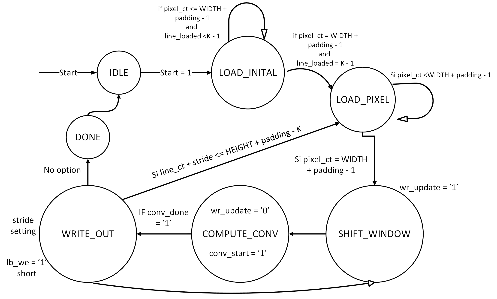
**Figure:** FSM used to coordinate loading, shifting, convolution, and output generation.

**Main ports:**

| Port | Direction | Description |
|---|---|---|
| `start` | in | Starts the full processing sequence |
| `effective_K` | in | Active kernel size |
| `stride` | in | Active stride value |
| `padding` | in | Active padding value |
| `lb_we` | out | Enables LineBuffer writes |
| `wr_update` | out | Triggers the sliding window update |
| `conv_start` | out | Starts convolution computation |
| `conv_done` | in | Indicates convolution result is ready |
| `ob_we` | out | Output timing / write-enable signal |
| `finished` | out | End of frame processing |

The FSM design also reflects the thesis goal of balancing **throughput** and **control simplicity** in streaming hardware.

***

### `LineBuffer`

**File:** `LineBuffer-7.vhd`

The LineBuffer is the first core memory element in the input stage. Its purpose is to store one full row of the image so that multiple adjacent rows can be accessed simultaneously while the input image is still arriving serially, pixel by pixel.

In convolution hardware, this is essential because a K×K mask requires access to K rows at the same time. Since the image arrives in raster order, the current row is available directly, but the previous rows must be retained in memory. For that reason, a kernel of size K×K requires **K−1 LineBuffers**.


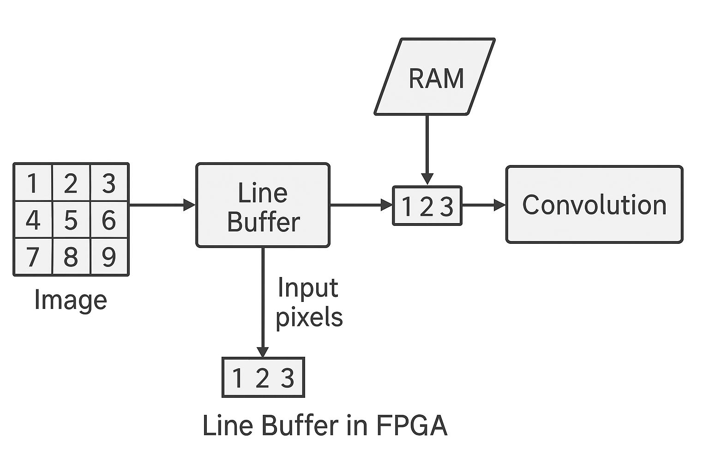
**Figure:** Conceptual role of a line buffer in FPGA image processing.

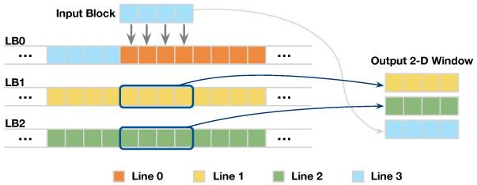

**Figure:** Row selection mechanism for convolution window generation.

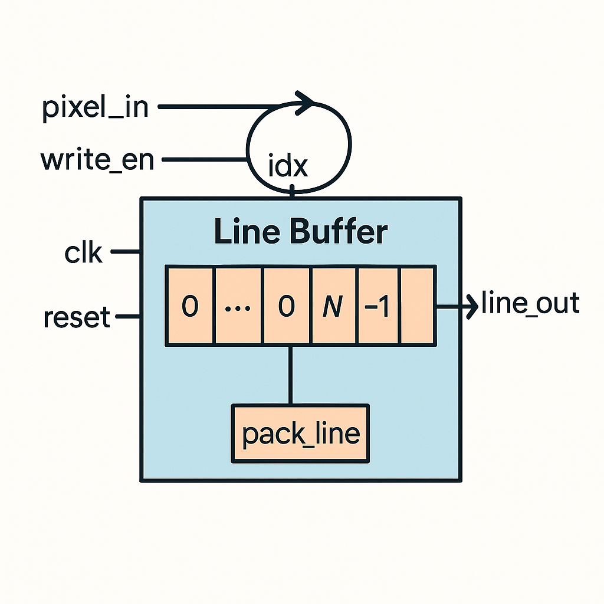
**Figure:** Functional cycle of the reconfigurable line buffer.


In this implementation, each LineBuffer:
- stores `WIDTH` pixels,
- advances one write index per valid clock,
- and outputs the full stored line packed into a vector.

The code uses a memory array (`ram_type`) and a helper function `pack_line` to flatten the stored row. This matches the thesis explanation that the LineBuffer was intentionally made generic to support different image widths and bit depths during experimentation.

**Generics:**
- `WIDTH`: number of pixels per row
- `BITS`: bits per pixel

From the thesis point of view, the LineBuffer is the hardware block that enables the transition from **sequential image input** to **parallel row access**.

***

### `WindowRegister`

**File:** `WindowRegister-2.vhd`

The WindowRegister is responsible for constructing and maintaining the active convolution mask. While the LineBuffers provide full delayed image rows, the WindowRegister extracts the exact K×K region needed at the current step and keeps it aligned for the convolution core.

Conceptually, this block behaves like a **sliding 2D register array**. At each update:
- the stored values are shifted,
- a new vertical pixel column is inserted,
- and any inactive positions beyond `effective_K` are cleared.

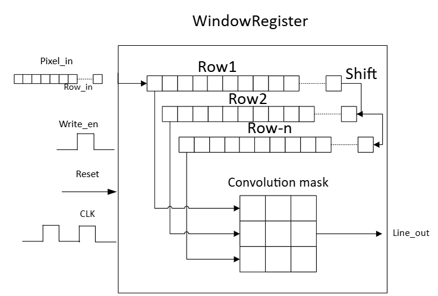

**Figure:** Conceptual WindowRegister structure.

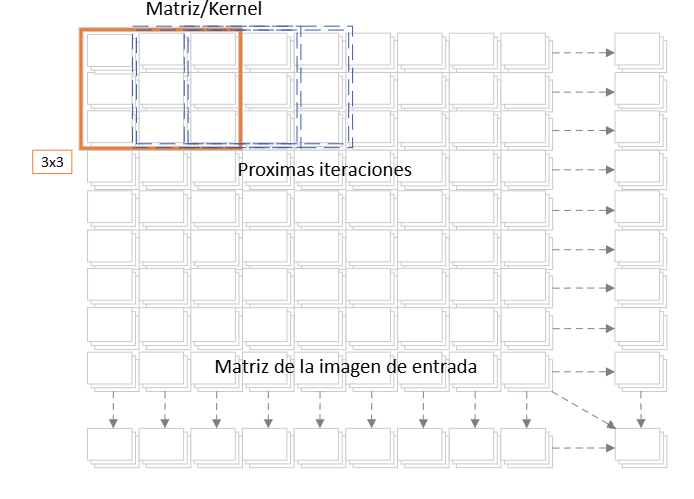

**Figure:** Sliding convolution mask over the input image.

This behavior matches the thesis description of **extracción de máscara de convolución**, where the system must rebuild the local convolution window in real time while preserving the correct spatial order of pixels.

An important design detail is that the code separates the functionality into two parts:
- a sequential process that updates the internal 2D register matrix,
- and a combinational flattening process that packs the matrix into a single vector for use by the ConvolutionBlock.

This module is also central to the reconfigurable design strategy because it supports any active kernel size from 1×1 up to `K_MAX × K_MAX` without redesign.

**Generics:** `K_MAX`, `BITS`

**Key idea:** the WindowRegister transforms a stream of columns into a stable computation window.

***

### `FilterMemory`

**File:** `FilterMemory-6.vhd`

The FilterMemory stores the convolution coefficients used by the accelerator. In CNN terms, this block acts as the local filter bank for the current layer.

The thesis describes this module as part of the hardware support needed to turn the convolution stage into a reusable accelerator. Instead of hard-coding one filter set in the VHDL source, the design allows the coefficients to be loaded dynamically using `coeffs_load` and `load_en`. This is critical for:
- testing different filters,
- processing multiple CNN layers,
- and reusing the same hardware for different experiments.

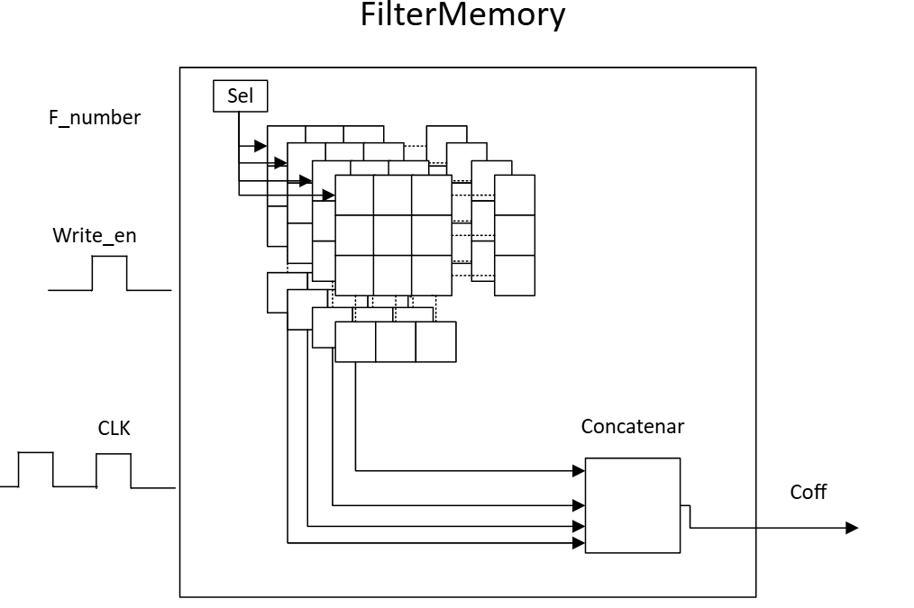
**Figure:** FilterMemory organization for runtime loading of convolution coefficients.

The implementation stores up to `F_MAX` filters, each with up to `K_MAX²` coefficients. The active configuration is controlled through:
- `effective_F`, the number of active filters,
- `effective_K`, the active kernel size.

Unused coefficients and filters are filled with zeros so the same packed buses can always be used, independently of the active configuration.

The thesis also discusses filter examples such as:
- averaging filters,
- Sobel edge detection,
- sharpening filters,
- high-pass filters,
- and approximate Gaussian kernels.

These examples are useful because they connect the hardware architecture to practical image-processing tasks beyond CNN benchmarking.

***

### `ConvolutionBlock`

**File:** `ConvolutionBlock-5.vhd`

The ConvolutionBlock is the arithmetic core of the accelerator. This is the module where the window pixels and filter coefficients are actually combined to compute the convolution result.

The thesis explains this block in three conceptual stages:
1. **matrix of multipliers (MAC base stage)**,
2. **accumulation strategy**, 
3. **parallel reduction with an adder tree**.

That structure is reflected directly in the VHDL code.

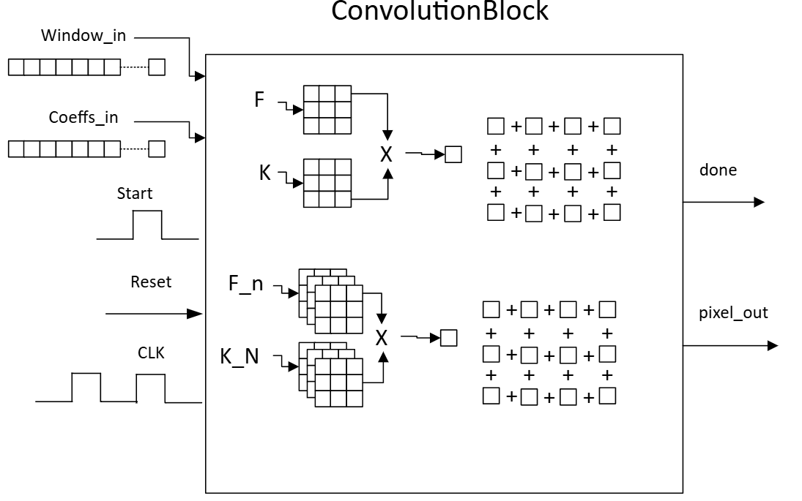
**Figure:** General convolution block.

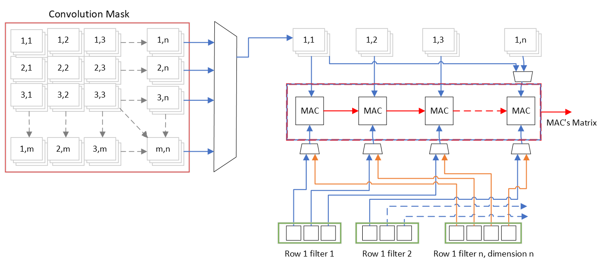
**Figure:** Parallel multiplication across filter elements.

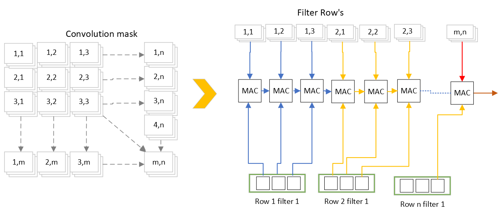
**Figure:** Arithmetic workload per filter.

#### Internal operation

The implementation can be interpreted as four logical phases:

1. **Extraction phase**
   - `extract_proc` unpacks the flattened input window and filter coefficient buses into typed internal arrays.
   - This makes later arithmetic operations easier to express and scale.

2. **Multiplication phase**
   - `mult_proc` computes the element-wise products between each pixel and the corresponding filter coefficient.
   - This phase represents the parallel MAC front-end described in the thesis.

3. **Summation phase**
   - `sum_proc` reduces the products to a single output per filter.
   - Instead of adding products sequentially, the implementation uses an **adder tree**, which reduces accumulation depth and improves timing compared with a long serial chain.

4. **Packing phase**
   - `output_proc` repacks the filter sums into the `pixel_out` vector.
   - 
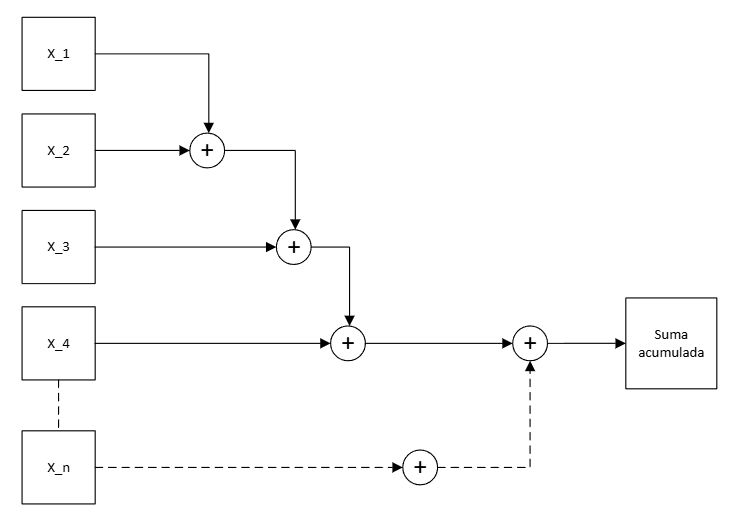

**Figure:** Sequential accumulation reference.

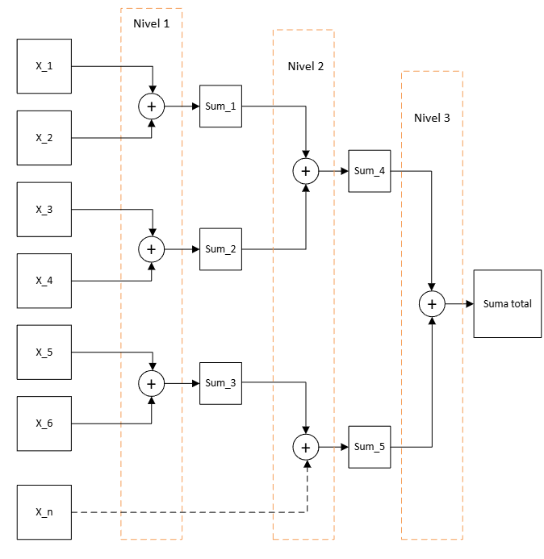

**Figure:** Adder-tree accumulation used to reduce reduction depth.

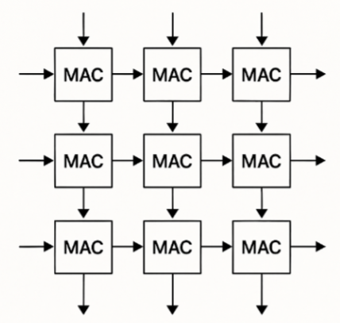

**Figure:** MAC array used in the convolution core.

#### Why the adder tree matters

One of the most important thesis decisions is replacing a purely sequential sum with a **tree-based reduction**. In convolution, a kernel of size K×K requires `P = K²` products. If those products are added sequentially, latency grows linearly with P. By using a reduction tree, the summation depth grows approximately with `log2(P)`, which is much better suited for FPGA parallel hardware.

This module therefore captures the main optimization idea of the thesis: exploit **parallelism in arithmetic operations** while still keeping the structure configurable.

**Generics:**
- `K_MAX`
- `F_MAX`
- `P_MAX`
- `BITS`
- `COEFFW`
- `OUTW`

**Design role in the thesis:** this is the block used to study the trade-off between **processing time** and **hardware resource usage** as K and F increase.

***

### `ActivationFunction`

**File:** `ActivationFunction-3.vhd`

This module implements the optional post-convolution activation stage. In the thesis, the selected activation is **ReLU (Rectified Linear Unit)**, one of the most common nonlinear functions used in CNNs.

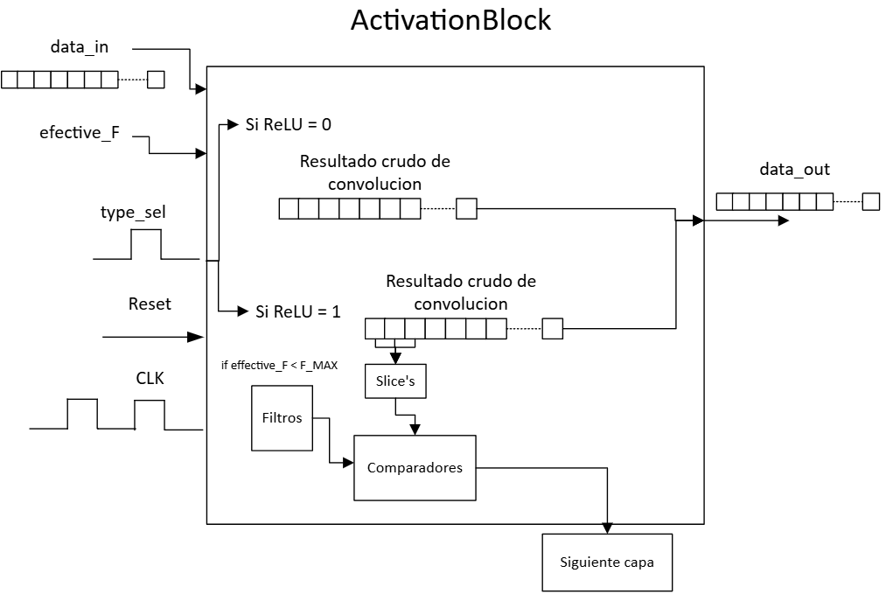
**Figure:** ReLU activation block integrated into the multicore / multilayer architectur

The supported modes are:

| `type_sel` | Function |
|---|---|
| `0` | Pass-through |
| `1` | ReLU: `max(0, x)` |

The code interprets each output as a signed value and clips negative results to zero when ReLU is enabled. Outputs beyond `effective_F` are explicitly zeroed.

This module is particularly important in the thesis because it shows the transition from a pure image-filtering accelerator toward a more complete **CNN-oriented convolution block**. Adding activation makes the design better suited for multi-layer neural network experiments.

***

### `OutputBuffer`

**File:** `OutputBuffer-8.vhd`

The OutputBuffer stores one output row and can be used as the output staging memory of the convolution pipeline. It writes one result pixel at a time and raises `data_valid` when a full row has been completed.

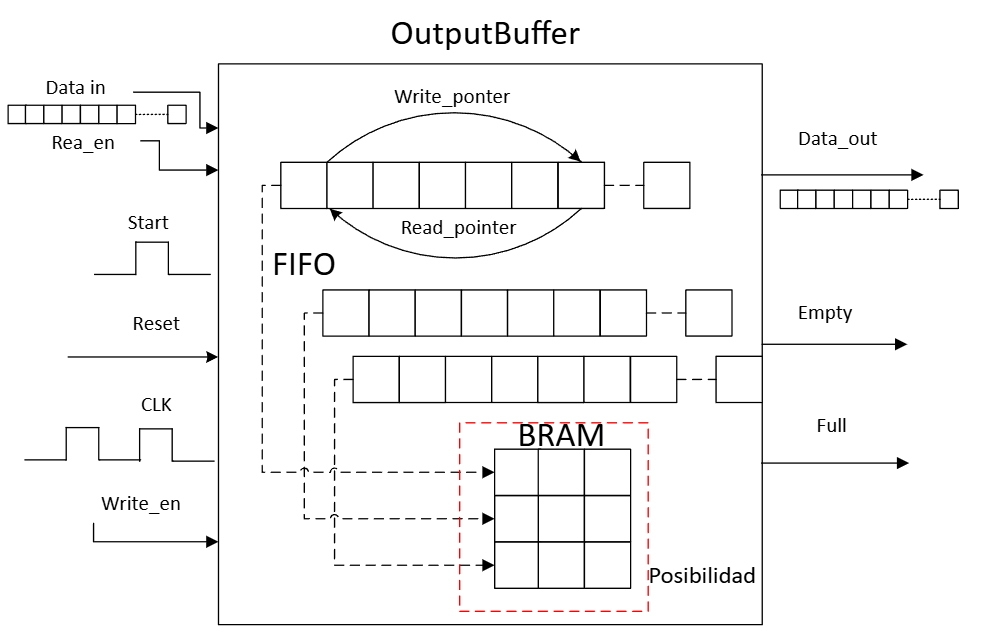
**Figure:** Output buffer structure for result staging and possible memory interfacing.

In the current top-level version, this module is present in the project but commented out in the structural interconnection. Instead, `data_valid` is directly driven from the controller write timing. Even so, the module remains valuable because the thesis considers it part of the general accelerator architecture and its use becomes relevant for future extensions involving larger output handling or memory-connected processing chains.

Functionally, this block mirrors the role of the LineBuffer, but on the output side of the datapath.

***
## Multi-Layer Extension

A major contribution of the thesis is extending the original single-layer convolution architecture into a **multi-layer reusable hardware model**. Instead of synthesizing a different design for every layer, the architecture is built around maximum supported limits and then configured layer by layer through runtime inputs and testbench-loaded parameter files.

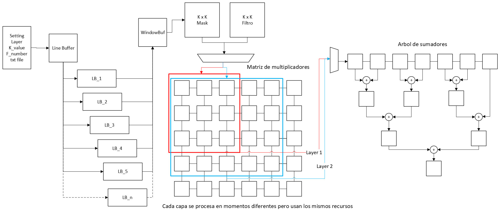
**Figure:** General multi-layer hardware organization.
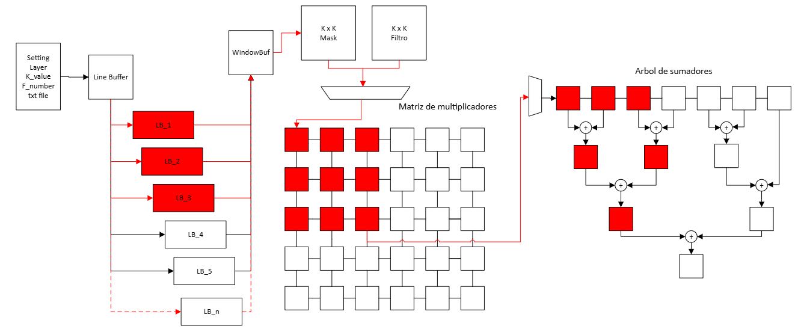
**Figure:** Resource distribution example for layer 1 in the multi-layer structure.
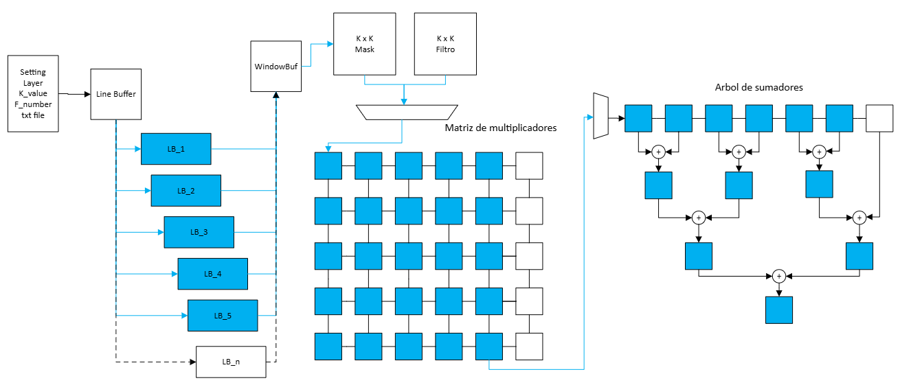
**Figure:** Resource distribution example for layer 2 in the multi-layer structure.


This is visible in both the top-level ports and the testbench behavior. Parameters such as `effectiveK`, `effectiveF`, `stridein`, `paddingin`, and `activationtype` are loaded for each layer from text files, while weights are loaded separately and input/output feature maps are chained through text outputs between iterations.

The thesis explains that this strategy supports **resource reuse** across layers. The same physical hardware is reused sequentially, while only the active subset of filters, arithmetic paths, and control settings changes from one layer to another. This is a practical FPGA-oriented way to support CNN experimentation without requiring separate hardware generation for every network layer.

***

## Generic Parameters

These generics define the maximum hardware capacity of the accelerator at synthesis time:

| Generic | Default | Description |
|---|---|---|
| `WIDTH` | 32 | Image width in pixels |
| `HEIGHT` | 32 | Image height in pixels |
| `K_MAX` | 5 | Maximum kernel dimension |
| `F_MAX` | 5 | Maximum number of filters |
| `BITS` | 9 | Bits per input pixel |
| `COEFFW` | 9 | Bits per filter coefficient |
| `OUTW` | 18 | Bits per convolution output |

The thesis later extends the architecture toward larger multi-layer cases by adopting **maximum generic ranges** and then selecting the active configuration dynamically through ports. This is one of the reasons why the project can be described as **reconfigurable hardware** rather than a fixed convolution core.

***

## Port Interfaces

### `top_convolution` ports

| Port | Direction | Width / Type | Description |
|---|---|---|---|
| `clk` | in | 1 | System clock |
| `reset` | in | 1 | Active-high reset |
| `start` | in | 1 | Starts image processing |
| `effective_K` | in | integer | Active kernel size |
| `effective_F` | in | integer | Active filter count |
| `stride_in` | in | integer | Runtime stride |
| `padding_in` | in | integer | Runtime padding |
| `activation_type` | in | integer | Activation selection |
| `coeffs_load_en` | in | 1 | Coefficient load enable |
| `coeffs_load` | in | packed vector | All filter coefficients |
| `pixel_in` | in | `BITS` | Input pixel |
| `pixel_out` | out | `F_MAX × OUTW` | Packed outputs per filter |
| `data_valid` | out | 1 | Output timing indicator |
| `done` | out | 1 | End of processing |

These ports reflect the thesis goal of creating a convolution engine that can adapt to different experimental scenarios from the outside, instead of embedding one rigid CNN layer into hardware.

***

## Supported Filter Types

Filters are loaded dynamically through `coeffs_load`, and the architecture can support both classical image-processing masks and CNN-trained kernels.

Examples discussed in the project include:

| Filter Type | Example Kernel |
|---|---|
| Averaging / Box blur | all ones |
| Sobel horizontal | `[-1 0 1; -2 0 2; -1 0 1]` |
| Sharpen | `[0 -1 0; -1 5 -1; 0 -1 0]` |
| High-pass | `[-1 -1 -1; -1 8 -1; -1 -1 -1]` |
| Gaussian approximation | `[1 2 1; 2 4 2; 1 2 1]` |
| CNN learned filters | runtime-loaded from external data |

This makes the accelerator useful both for **classical image convolution** and for **CNN feature extraction experiments**.

***

## Simulation & Testbench

**File:** `Try_2_TB.vhd`

The testbench is a major part of the workflow because it bridges the gap between offline image preparation and hardware simulation. It reads plain-text files containing:
- layer configuration,
- filter coefficients,
- and image pixels,
then feeds them to the accelerator in sequence.

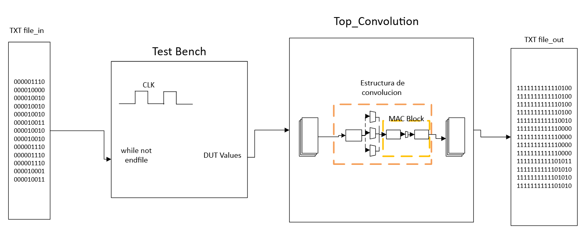
**Figure:** Testbench structure used for simulation.

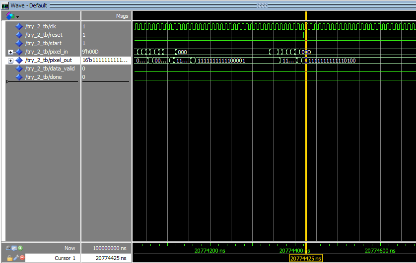
**Figure:** Example waveform captured in QuestaSim.

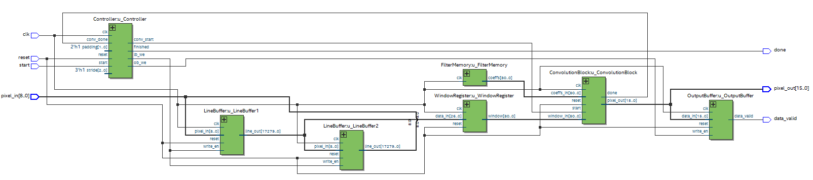
**Figure:** Synthesized or elaborated netlist view.

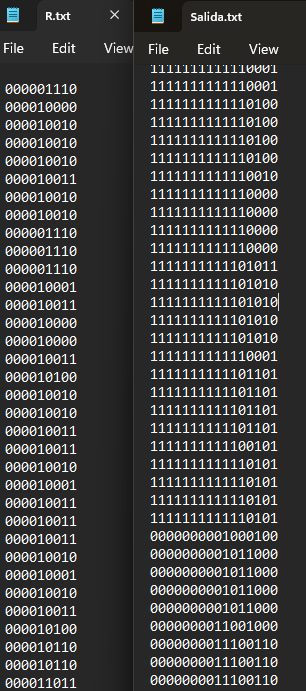

**Figure:** Text-file based input/output flow used during simulation.

This matches the thesis methodology, where the image is first preprocessed in software and then injected into the VHDL design as binary fixed-point data.

### Input preparation flow

According to the thesis, the image preprocessing stage follows these steps:

1. Separate RGB channels if needed.
2. Normalize pixel values.
3. Convert values to a binary fixed-point representation.
4. Export the result to a text file.
5. Load that text file from the testbench using `TEXTIO`.

### Layer configuration files

For each layer `N`, the testbench uses external text files such as:

| File | Description |
|---|---|
| `layerN_config.txt` | Contains `K`, `F`, `stride`, `padding`, and `activation` |
| `pesos_layerN.txt` | Contains the coefficients of the active filters |
| `G.txt` | Initial image input for layer 1 |
| `output_layerN.txt` | Output generated by simulation |

### Example `layerN_config.txt`

```text
K=3
F=2
stride=1
padding=0
activation=1
```

### Simulation results examples
To validate the proposed architecture, extensive simulations were conducted using QuestaSim and Quartus software. The following results demonstrate the correct functionality, timing behavior, and overall performance of the design under various operating conditions, confirming the effectiveness and reliability of the implemented architecture.


**Figure:** Input image example
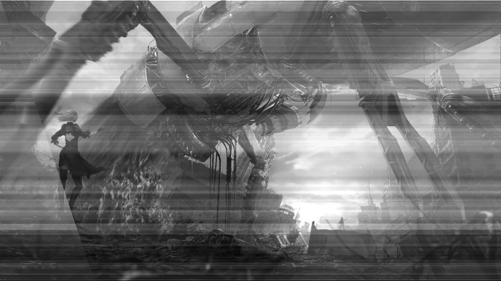
**Figure:** Matlab result image
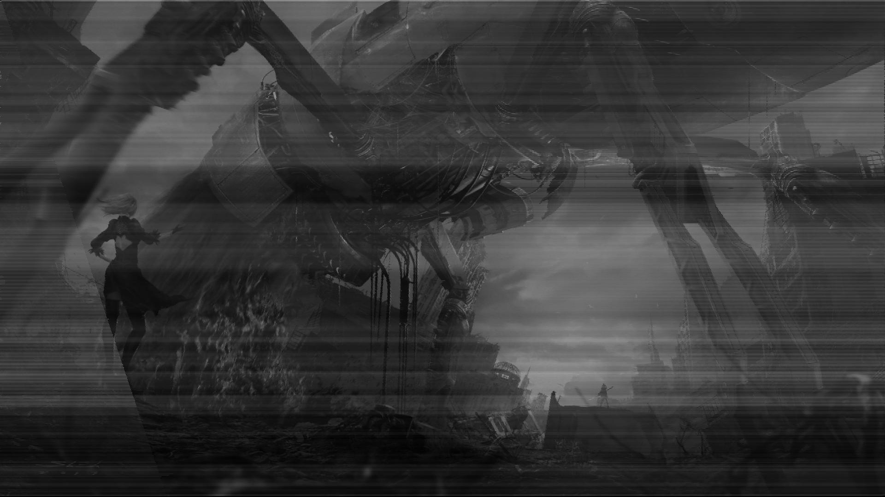
**Figure:** Architecture result correction 1
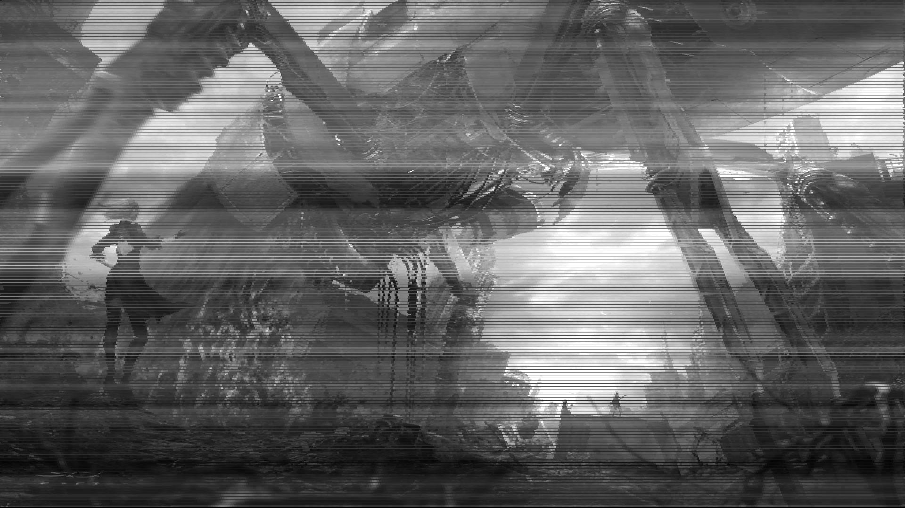
**Figure:** Architecture result correction 2
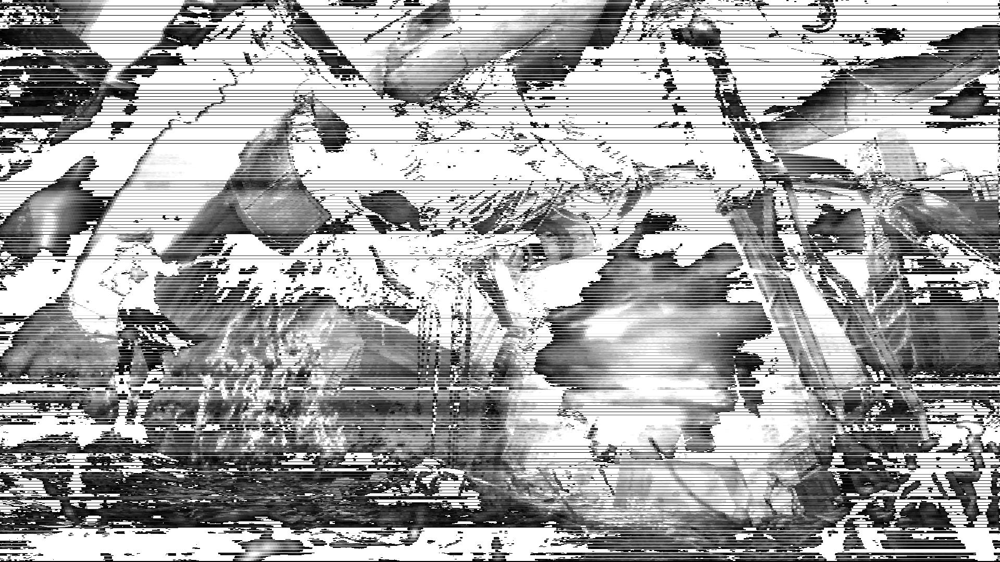
**Figure:** Edge detector result image


### Multi-layer operation

One of the strongest improvements introduced in the thesis is the extension to **multi-layer convolution**. The testbench reflects this idea by processing the output of one layer as the input to the next layer. Between layers, the design is reset, new weights are loaded, and the next convolution stage begins.

This demonstrates how the accelerator can be reused sequentially across CNN layers while keeping the same synthesized hardware.

### Suggested waveform signals

For debugging and validation, the most relevant signals are:
- `clk`, `reset`, `start`, `done`, `data_valid`
- `pixel_in`, `pixel_out`
- `lb_we`, `wr_update`, `conv_start`, `conv_done`, `ob_we`

These are the same kinds of signals highlighted in the thesis simulation discussion.

***

## File Structure

```text
project/
├── top_convolution-9.vhd      # Top-level structural architecture
├── Controller-4.vhd           # FSM controller and synchronization logic
├── LineBuffer-7.vhd           # Input row buffer
├── WindowRegister-2.vhd       # Sliding K×K window extractor
├── FilterMemory-6.vhd         # Runtime-loadable filter storage
├── ConvolutionBlock-5.vhd     # Parallel arithmetic core
├── ActivationFunction-3.vhd   # ReLU / pass-through stage
├── OutputBuffer-8.vhd         # Output row buffer
├── Try_2_TB.vhd               # Simulation testbench
└── README.md                  # Project documentation
```

If you also publish the thesis-support files used in simulation, a useful extension would be:

```text
├── data/
│   ├── layer1_config.txt
│   ├── pesos_layer1.txt
│   ├── G.txt
│   └── output_layer1.txt
└── docs/
    ├── thesis-figures/
    └── waveform-images/
```

***

## How to Run

### In Vivado or Quartus

1. Create a new RTL project.
2. Add all VHDL source files.
3. Add `Try_2_TB.vhd` as the simulation source.
4. Update the `BASE_PATH` inside the testbench so it points to your configuration, weight, and image text files.
5. Run simulation.
6. Observe waveform timing and compare output files against software-generated references.

### In ModelSim / Questa

```tcl
vcom -work work Controller-4.vhd
vcom -work work LineBuffer-7.vhd
vcom -work work WindowRegister-2.vhd
vcom -work work FilterMemory-6.vhd
vcom -work work ConvolutionBlock-5.vhd
vcom -work work ActivationFunction-3.vhd
vcom -work work OutputBuffer-8.vhd
vcom -work work top_convolution-9.vhd
vcom -work work Try_2_TB.vhd
vsim work.Try_2_TB
add wave -recursive *
run -all
```

***

## Design Notes

- **Streaming operation:** The architecture processes one pixel per clock cycle in its input flow, which is consistent with the real-time hardware approach described in the thesis.
- **LineBuffer count:** For a kernel of size `K×K`, the architecture requires `K-1` LineBuffers.
- **Reconfigurable hardware:** Maximum capacities are fixed through generics, while active configuration is selected through runtime ports.
- **Stride and padding:** These are integrated in the control logic rather than hard-coded into the arithmetic path.
- **Adder-tree accumulation:** The summation stage is designed to reduce accumulation depth and improve performance compared with sequential addition.
- **Activation support:** ReLU turns the design from a pure image filter engine into a more CNN-oriented building block.
- **Multi-layer reuse:** The same synthesized hardware can process several convolution layers by reloading parameters and coefficients.
- **OutputBuffer integration:** The module exists and is documented, but its structural connection is currently simplified at the top level.
- **Fixed-point caution:** Since the design uses finite-width arithmetic, `OUTW` must be chosen carefully to avoid overflow when large kernels or large coefficients are used.

### Thesis-aligned interpretation

This repository is more than a single VHDL implementation of convolution. It is also an experimental platform for studying how **parallelism**, **resource usage**, and **processing time** interact in FPGA-based CNN acceleration.

The thesis conclusions indicate that the architecture validates the theoretical model and that the most favorable operating point is obtained when the hardware degree of parallelism is aligned with the kernel arithmetic demand. In addition, the multi-layer extension shows that resource reuse can make the architecture practical for larger CNN-style workflows without rebuilding the design every time.

***

## License

This project is shared for academic, research, and educational purposes. It can be used as a base for FPGA image-processing systems, CNN accelerator experiments, or future work involving pooling, normalization, or external memory integration.
